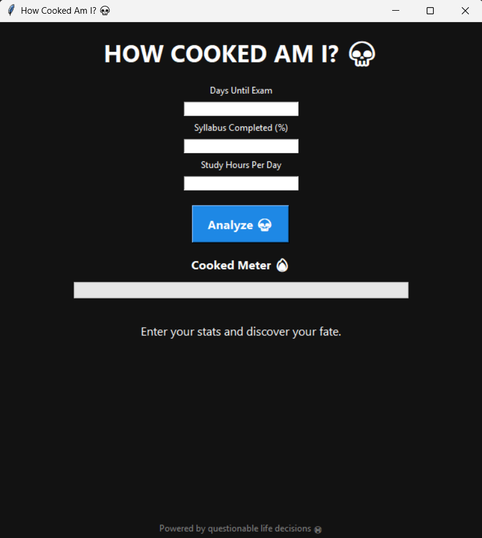

# 💀 HOW COOKED AM I?

<div align="center">

### 📚 ➜ 💀 ➜ 😭

**The world's most accurate*** exam survival predictor

*accuracy not guaranteed

</div>

---

## 🤨 What is this?

Have an exam in:

```text
2 days
```

Completed:

```text
7% of the syllabus
```

Studied:

```text
1 hour
```

And somehow still think:

> "nah I'd pass"

This app was made for you.

---

## 🔥 Features

### 📊 Cooked Meter

Watch your doom unfold in real-time.

```text
███████████████████░ 95%
```

---

### 🤖 Fake AI Analysis

Before revealing your fate, the app performs highly advanced calculations:

```text
Consulting ancient textbooks...
Scanning panic levels...
Contacting your future self...
Calculating survival odds...
```

Very scientific.

---

### 🎭 Random Roasts

Examples include:

> The textbook misses you.

> Bro is fighting for survival.

> The syllabus can smell your fear.

> Interesting strategy. Have you considered studying?

---

### ☠️ Grim Reaper Mode

For special individuals.

When your score gets high enough:

```text
☠️ EXAM REAPER HAS ARRIVED ☠️
```

At this point the app has officially lost faith in you.

---

## 📸 Preview



---

## 🚀 Running It

```bash
git clone https://github.com/yourusername/how-cooked-am-i.git

cd how-cooked-am-i

python main.py
```

---

## 🧪 Example Results

| Cooked Score | Status               |
| ------------ | -------------------- |
| 0-20         | 😎 Chilling          |
| 21-40        | 🙂 Slightly Cooked   |
| 41-60        | 😬 Medium Rare       |
| 61-80        | 🔥 Well Done         |
| 81-100       | ☠️ Absolutely Cooked |

---

## ⚠️ Warning

This application may cause:

* sudden self-reflection
* academic panic
* emergency study sessions
* acceptance of reality

Use responsibly.

---

## 🛠️ Built With

🐍 Python

🖼️ Tkinter

☕ Late-night coding

😭 Academic trauma

---

<div align="center">

### If the app says you're cooked...

## GO STUDY.

</div>
